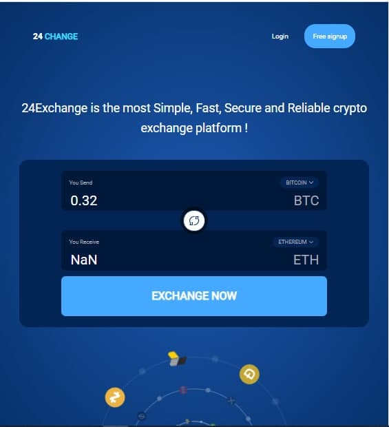
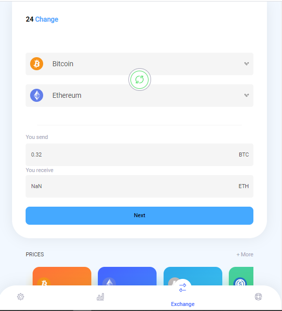
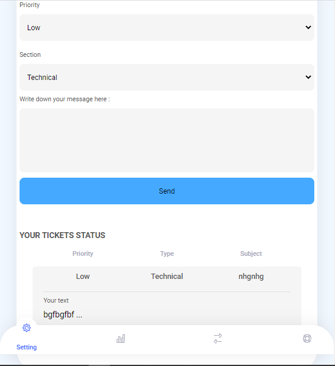
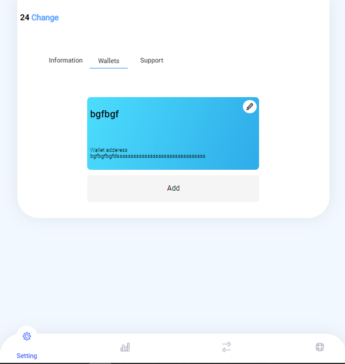

# ExchangeWebsite
Well made exchange website built in PHP-JAVASCRIPT-HTML-CSS
(see pictures at the end of the page)
# Description
simple well-made exchange website to improve my skills in html-css desining and also javascript codes
if you wana start a exchange website and need a point, this repository will help you a lot
its not fully completed ( you should handle sending support answers and transactions by your hand )
i have also included my frontend files which i made for practice, so you can see how they work without php
# Abilities 
- fully responsive design
- online price updating from binance.com
- save users wallet
- otp ( for password rechanging, transaction confirming )
- multi-functional support page
- add, remove, modify wallets
- see transactions + last website transactions list
- dynamic source code
and a lot more abilities which you can see in source
# How to run ?
implent database, change info in config.php, load in browser thats all :)
# Special thanks to
- Me - coder :) 
- Matingolmakani@gmail.com - project designer

# To do
- make it connected to a valid wallet providor website ( currently, wallets are static )
- add mailing functions ( i removed to make it easier in localhost )
- improve IOS responsive

## Donation : 17RybYB1zdwRB881BGM3hSW2coBBHkXQcN
## support / suggestion = ph09nixom@gmail.com - t.me/ph09nix
## Leave a STAR if you found this usefull :)

# Pictures

